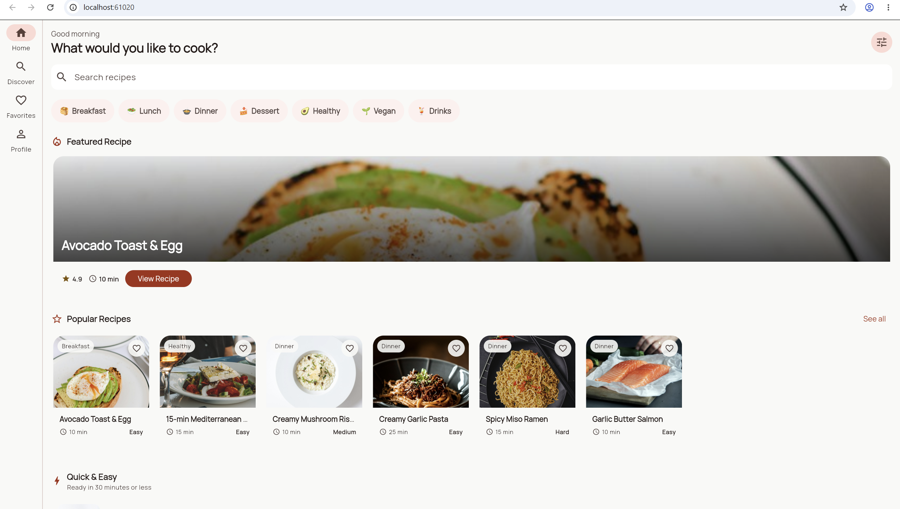
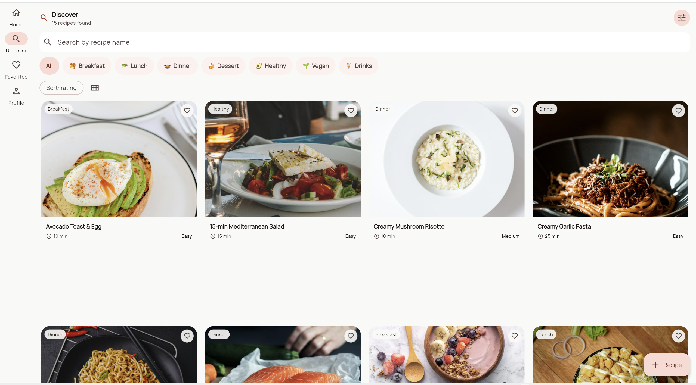
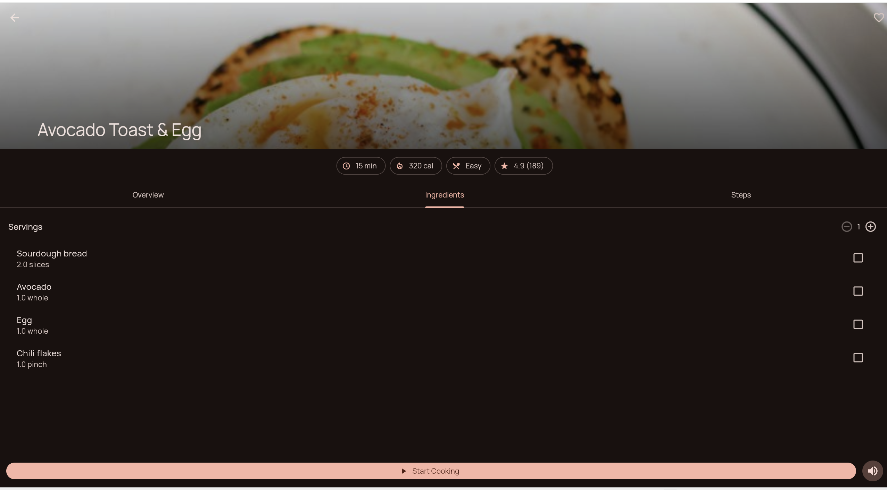
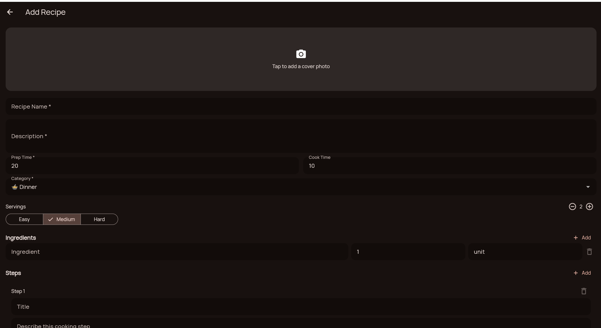
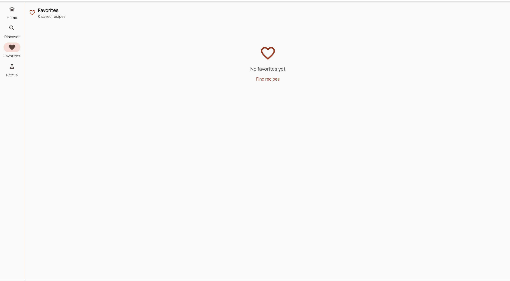
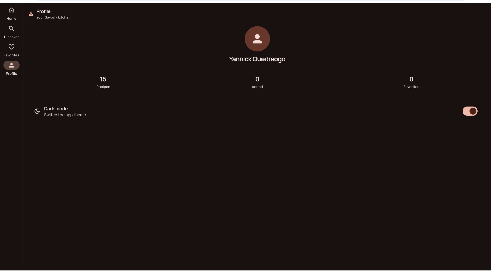

# Savorly

A multi-screen Flutter recipe app built for the NextFlutter "Multi-screen app with navigation" certification project.

## Features

- Browse featured, popular, and quick recipes on Home.
- Search, filter, sort, and switch grid density on Discover.
- Open recipe details through a `/recipe/:id` route parameter.
- Favorite recipes and review them from Favorites.
- Publish a recipe with a validated form, dynamic ingredients/steps, and a cover photo picker.
- Toggle light/dark mode from Profile.

## Getting Started

```bash
flutter pub get
flutter run -d chrome
```

You can also run on Windows or an Android device:

```bash
flutter run -d windows
flutter run -d <android-device-id>
```

Recipe photos load from fixed `images.unsplash.com` URLs. If the network is unavailable, the app shows graceful image fallbacks.

## Architecture

```text
lib/
  main.dart
  data/       RecipeRepository for bundled JSON
  models/     Recipe, RecipeIngredient, RecipeStep, Category
  router/     GoRouter routes and adaptive app shell
  screens/    Home, Discover, Favorites, Profile, Recipe Detail, Add Recipe
  state/      RecipeStore and ThemeController
  theme/      Savorly light/dark Material themes
  widgets/    Shared recipe/category/section widgets
```

Recipe and category data live in `assets/data/*.json`, not inside widgets.

## NextFlutter Requirements Checklist

| Requirement | Implementation |
| --- | --- |
| At least 4 distinct screens | 6 screens in `lib/screens/` |
| GoRouter or Navigator 2.0 named routes | `lib/router/app_router.dart` with named GoRouter routes |
| List screen with search/filtering | `DiscoverScreen` search, category chips, filter sheet, sort |
| Detail screen with parameter passing | `RecipeDetailScreen` receives `/recipe/:id` |
| Form with validation | `AddRecipeScreen` validates title, description, prep time, ingredients, and steps |
| Light/dark theme support | `lib/theme/app_theme.dart` plus Profile toggle |
| At least 8 different widgets | `ListView`, `GridView`, `Stack`, `Card`, `TextField`, `DropdownButtonFormField`, `SegmentedButton`, `NavigationBar`, `NavigationRail`, `TabBar`, `CheckboxListTile`, `SnackBar`, `Image.network` |
| At least 3 reusable widgets | 5 widgets in `lib/widgets/` |
| Responsive mobile/tablet | Bottom `NavigationBar` on mobile, `NavigationRail` and wider grids from 600px |
| No hardcoded data in widgets | Recipes/categories loaded from bundled JSON through `RecipeRepository` |

## Testing

```bash
flutter analyze
flutter test
```

The tests cover model JSON parsing, repository loading, store derivations/mutations, theme state, reusable cards, and app navigation smoke behavior.

## Screenshots

<div align="center">
  
  
  
  
  
  
</div>
